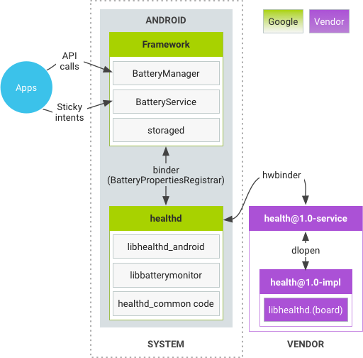
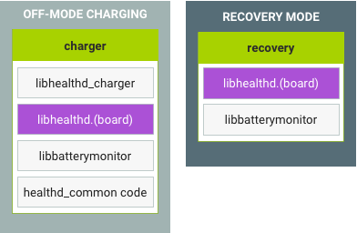
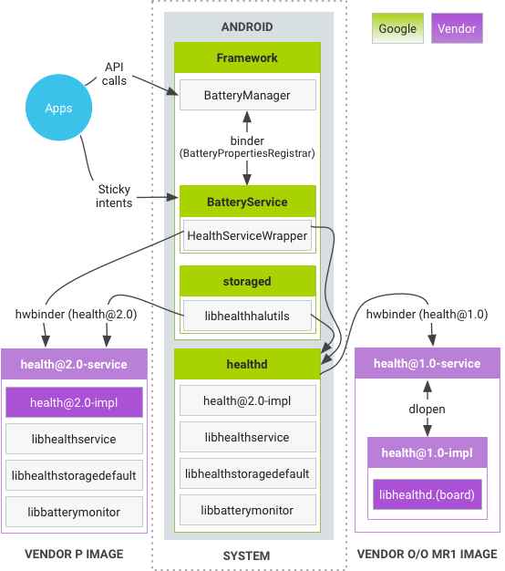
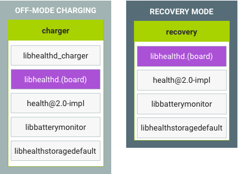

Project: /_project.yaml
Book: /_book.yaml



<!--
    Copyright 2018 The Android Open Source Project
    Licensed under the Apache License, Version 2.0 (the "License");
    you may not use this file except in compliance with the License.
    You may obtain a copy of the License at
    http://www.apache.org/licenses/LICENSE-2.0
    Unless required by applicable law or agreed to in writing, software
    distributed under the License is distributed on an "AS IS" BASIS,
    WITHOUT WARRANTIES OR CONDITIONS OF ANY KIND, either express or implied.
    See the License for the specific language governing permissions and
    limitations under the License.
-->

# Performance and Health

Take advantage of the many tests and tools described in
<a href="/devices/tech/debug/eval_perf">Evaluating Performance</a> as part of
your work getting the most out of Android.

Android {{ androidPVersionNumber }} includes `android.hardware.health` HAL 2.0,
a major version upgrade from health@1.0 HAL. This new HAL has the following
advantages:

*   Cleaner separation between framework and vendor code.
*   Deprecates the unnecessary `healthd` daemon.
*   Greater degrees of freedom for vendor customization in health information
    reports.
*   More device health information than just battery.

## Requirements

Devices launching with Android {{ androidPVersionNumber }} must provide the 2.0
HAL (and must not provide the 1.0 HAL). Devices not launching with Android 
{{ androidPVersionNumber }} but planning to update the vendor image to Target
Framework Compatibility Matrix Version 3 (released in Android 
{{ androidPVersionNumber }}) must remove existing 1.0 HAL implementations and
provide the 2.0 HAL.

AOSP includes multiple helper libraries designed to help you implement the 2.0
HAL and the transition from the old 1.0 HAL.

## Terminology

*   **health@1.0**: abbreviation of `android.hardware.health@1.0`. Refers to
    health HIDL HAL version 1.0 released in Android 8.0.
*   **health@2.0**: abbreviation of `android.hardware.health@2.0`. Refers to
    health HIDL HAL version 2.0 released in Android {{ androidPVersionNumber }}.
*   **charger**: executable running in off-mode charging that displays the
    phone-charging animation.
*   **recovery**: executable running in recovery mode that must retrieve battery
    information.
*   **healthd**: legacy daemon running in Android that retrieves health-related
    information and provides it to framework.
*   **storaged**: daemon running in Android that retrieves storage information
    and provides it to framework.

## Health in Android 8.x

In Android 8.x, the health component works as detailed in the following diagram:

**Figure 1**. Health in Android 8.x

In this diagram:

*   One (1) binder call and one (1) hwbinder call are used by the framework to
    communicate with hardware.
*   `healthd` statically links to `libhealthd_android`, `libbatterymonitor`, and
    `libbatteryservice`.
*   health@1.0-impl statically links to
    <code>libhealthd.<var>BOARD</var></code>.

Each board can customize a different <code>libhealthd.<var>BOARD</var></code>;
it is determined at build time what charger, health@1.0-impl, and recovery link
to.

For other modes:

**Figure 2.** Health in Android 8.x, off-mode charging and recovery mode

*   charger statically links to <code>libhealthd.<var>BOARD</var></code>,
    `libhealthd_charger` and `libbatterymonitor`.
*   recovery statically links to <code>libhealthd.<var>BOARD</var></code> and
    `libbatterymonitor`.

## Health in Android {{ androidPVersionNumber }}

In Android {{ androidPVersionNumber }}, the health component works as detailed
in the following diagram:

**Figure 3**. Health in Android {{ androidPVersionNumber }}

The framework attempts to retrieve health@2.0 service from `hwservicemanager`.
If it fails, it calls into health@1.0 (in Android 8.x). The legacy code path is
kept so the Android {{ androidPVersionNumber }} system image is compatible with
the Android 8.x vendor image. The framework does not retrieve information from
both HALs because only one service version (1.0 or 2.0) can exist on the device.

Note: For the legacy code path, the processes/libraries will be kept until
health@1.0 is
[deprecated](/devices/architecture/vintf/fcm#hal-version-deprecation).

For other modes:

**Figure 4.** Health in Android {{ androidPVersionNumber }}, off-mode charging
and recovery mode

## HAL interface

The health@2.0 HAL provides the same functionality to the framework as the old
healthd daemon. It also provides APIs that are similar to what healthd
previously provided as a binder service (i.e.
[IBatteryPropertiesRegistrar](https://android.googlesource.com/platform/frameworks/base/+/2392cbd888212f61a242058f749bcc39d495bf4b/core/java/android/os/IBatteryPropertiesRegistrar.aidl){: .external}).

The main interface,
[IHealth](https://android.googlesource.com/platform/hardware/interfaces/+/de542acbbf46812cfb53d231ecb50048baf8780e/health/2.0/IHealth.hal){: .external}
, provides the following functions:

*   `registerCallback`, to replace
    `IBatteryPropertiesRegistrar.registerListener`
*   `unregisterCallback`, to replace
    `IBatteryPropertiesRegistrar.unregisterListener`
*   `update`, to replace `IBatteryPropertiesRegistrar.scheduleUpdate`
*   `IBatteryPropertiesRegistrar.getProperties` are replaced by the following:
    *   `getChargeCounter`
    *   `getCurrentNow`
    *   `getCurrentAverage`
    *   `getCapacity`
    *   `getEnergyCounter`
    *   `getChargeStatus`
    *   `getHealthInfo`

In addition, `IHealth` provides the following new APIs for `storaged` to
retrieve vendor-specific storage related information:

*   `getStorageInfo`
*   `getDiskStats`

A new struct, `@2.0::HealthInfo`, is returned via callbacks and `getHealthInfo`.
This struct contains all device health information available through health@2.0
HAL, including:

*   Charging information (AC/USB/wireless, current, voltage, etc.)
*   Battery information (presence, battery level, current, voltage, charge,
    technology, etc.)
*   Storage information (storage device information, disk statistics)

For information on implementing the Health service, see
[Implementing Health](/devices/tech/health/implementation).
