Project: /_project.yaml
Book: /_book.yaml

<!--
  Copyright 2018 The Android Open Source Project

  Licensed under the Apache License, Version 2.0 (the "License");
  you may not use this file except in compliance with the License.
  You may obtain a copy of the License at

      http://www.apache.org/licenses/LICENSE-2.0

  Unless required by applicable law or agreed to in writing, software
  distributed under the License is distributed on an "AS IS" BASIS,
  WITHOUT WARRANTIES OR CONDITIONS OF ANY KIND, either express or implied.
  See the License for the specific language governing permissions and
  limitations under the License.
-->

# Android Settings Design Guidelines

This document highlights the principles and guidelines for anyone who is either
designing Android platform settings, GMS core settings (Google Settings) or any
developers designing settings for their Android app.

## Design principles

### Provide a good overview

Users should be able to glance at settings screens and understand all of the
individual settings and their values.

**Figure 1.** Settings and their current values are presented on the top-level
screen

### Organize items intuitively

Place frequently used settings at the top of the screen. Limit the number of
settings on one screen. Showing more than 10-15 items can be overwhelming.
Create intuitive menus by moving some settings to a separate screen.

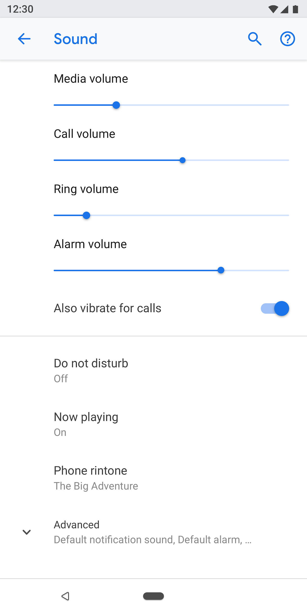

**Figure 2.** Common settings are at the top of the screen

### Make settings easy to find

In some cases, it may be helpful to duplicate an individual setting on two
different screens. Different situations can trigger users to change a setting,
so including the setting in multiple places will help users find this item.

For duplicate settings, create a separate screen for the setting and have entry
points from different places.

<table class="columns">
  <tr>
    <td>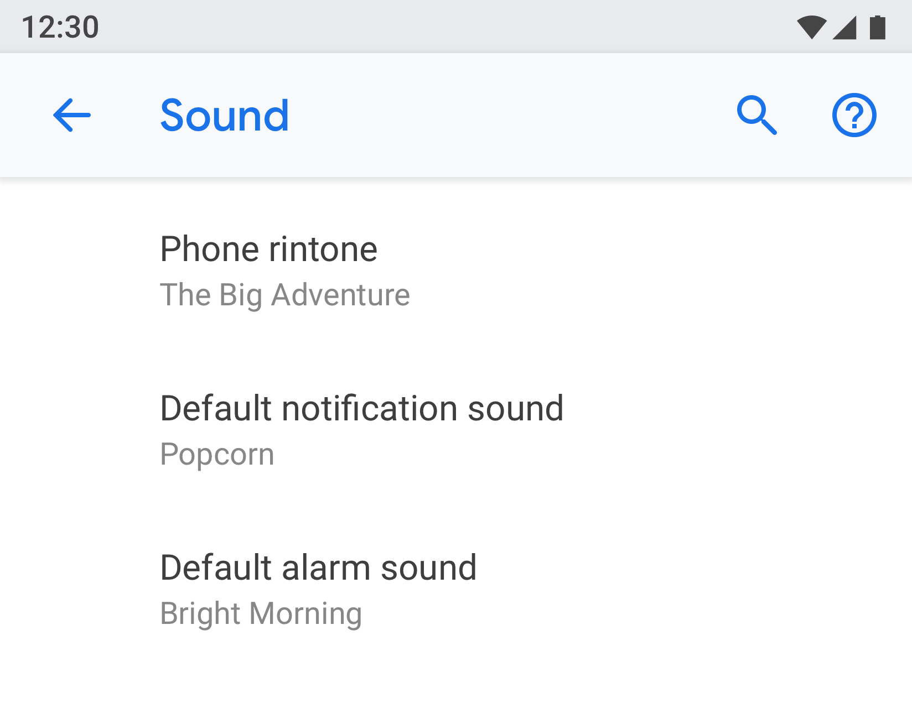</td>
    <td>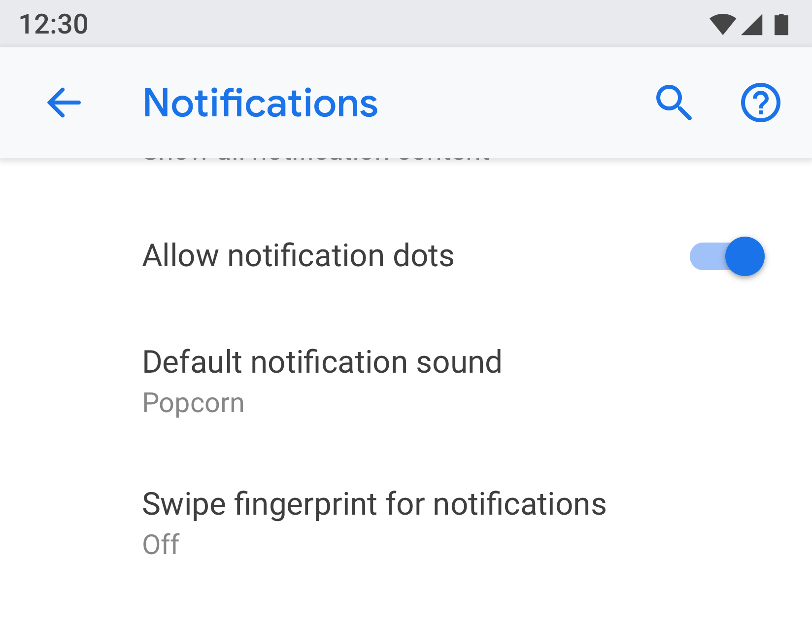</td>
  </tr>
</table>

**Figure 3 & 4.** "Default notification sound" appears on both the
"Notification" and "Sound" screens

### Use a clear title and status

Make your settings' titles brief and meaningful. Avoid using vague titles like
"General settings." Below the title, show the status to highlight the value of
the setting. Show the specific details instead of just describing the title.

Titles should:

+   Put the most important text of your label first.
+   Rephrase negative words like "don't" or "never" into neutral terms such as
    "block."
+   Use impersonal labels like "Notifications" instead of "Notify me."
    Exception: If referring to the user is necessary for understanding the
    setting, use the second person ("you") rather than the first person ("I").

Titles should avoid:

+   Generic terms, such as set, change, edit, modify, manage, use, select, or
    choose.
+   Repeating words from the section divider or subscreen title.
+   Technical jargon.

## Page types

### Settings list

This is the most common type of screen. It allows multiple settings to be placed
together. Settings lists can be a mix of controls, like switches, menus, and
sliders.

If there are many settings in one category, they can be grouped together. See
[Grouping & dividers](#grouping_dividers) for more details.

**Figure 5.** Example of settings list

### List view

The list view is used to show a list of items like apps, accounts, devices, and
more. Controls to filter or sort can be added to the screen.

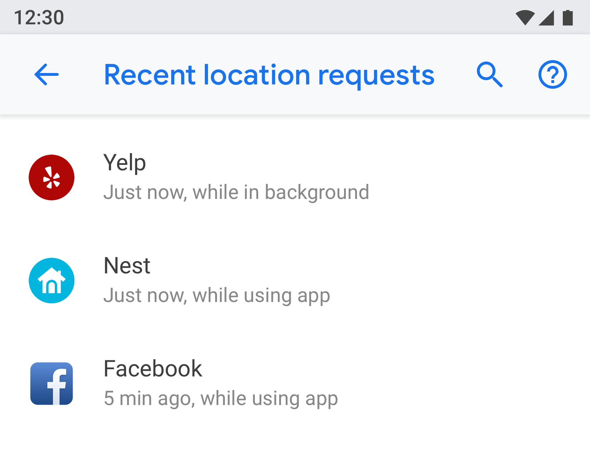

**Figure 6.** Example of List view

### Entity screen

The entity screen is used to present settings of a distinct item like an app,
account, device, Wi-Fi network, etc.

Visually, the entity is shown at the top with an icon, title, and subtitle. All
settings on this screen must be related to this entity.

**Figure 7.** Example of Entity screen used in App info

**Figure 8.** Example of Entity screen used in Storage

### Master setting

The master setting is best used when an entire feature can be turned on or off,
such as Wi-Fi or Bluetooth. By using a switch at the top of the screen, the user
can easily control this feature. Using the master setting to disable the feature
disables all other related settings.

If a feature needs a longer text description, the master setting can be used as
this screen type allows for longer footer text.

If a setting needs to be duplicated or linked from multiple screens, use the
master setting. Since the master setting is a separate screen, you'll avoid
having multiple switches in different places for the same setting.

**Figure 9.** Example of master setting used in App notifications screen;
turning off the master toggle will turn of the entire feature for this app

**Figure 10.** Example of master setting used in App notifications screen with
master toggle turned off

### Radio button selection screen

This screen is used when the user needs to make a selection for a setting. Radio
buttons can either be shown in a dialog or on a separate screen. Radio buttons
should not be used alongside sliders, menus, or switches.

A radio button screen can contain an image at the top and footer text at the
bottom. The individual radio buttons can have subtext along with a title.

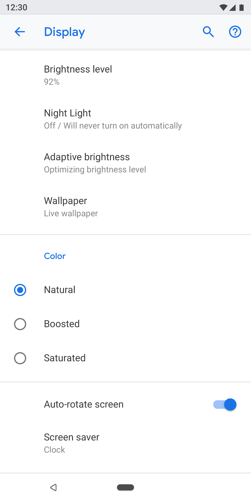

**Figure 11.** Radio buttons should not be used in settings list

**Figure 12.** This is how to use radio buttons correctly in settings

## Components

### Header

Starting in Android 8.0, the action toolbar presents search and help along with
other related actions. Overflow menus are discouraged as users may not discover
actions hidden in these menus.

**For toolbars with no screen-specific actions.** Show search and help actions.

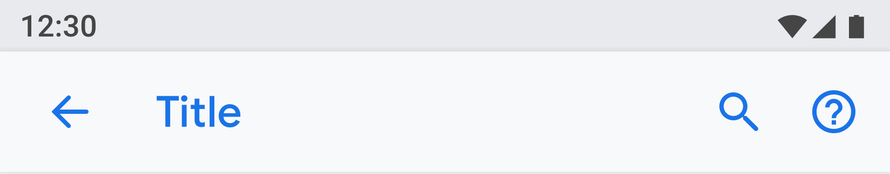

**Figure 13.** Toolbar with search and help actions

**For toolbars with one action**: Present the action before search.

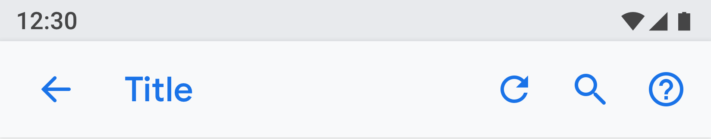

**Figure 14.** Toolbar with one action before the search and help actions

**For toolbars with more than 1 action**: Consider placing the primary action
before search, while putting advanced actions in the overflow menu.

If all actions are advanced or only useful for a small set of users, consider
placing all actions in the overflow menu.

**Figure 15.** Toolbar with an overflow menu for actions

### Entity header

The entity header can show a heading only, or heading with subtext (multiple
lines are allowed for the subtext). The action below is optional. You can have a
maximum of two actions.

**Figure 16.** Entity header

The icon and heading (App1) part will scroll under the header (App info).

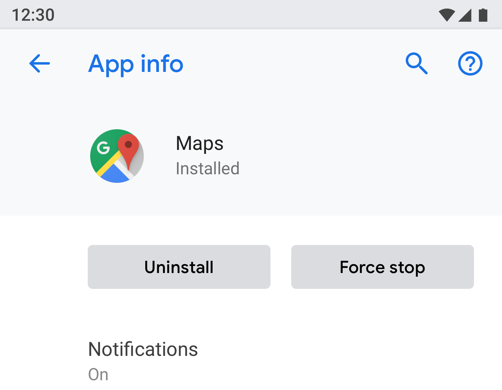

**Figure 17.** App info title here is part of the toolbar, while the rest of the
screen will scroll under it

### Menu link

The title is mandatory. You should also show subtext that highlights the status
of the setting. Using an icon is optional.

Try to keep title text concise. If titles are long, they can continue on the
next line instead of being truncated. Don't enable menus or actions on long
press.

Examples:

**Figure 18.** Menu link with icon, title, and subtext

**Figure 19.** Menu link with title and subtext

**Figure 20.** Menu link with title only

**Menu link with icon, title, subtext and a separate hit target on the right**

Other tap targets should use the theme color.

**Figure 21.** Example of two-tap target menu

**Menu link with icon, title, subtext and stats/number/alert icon**

Numerical values like percentage and time can be shown on the right along with
the subtext, while a bar graph can be shown below.

Usually, the numerical values are presented on the right so users can easily
glance and compare them.

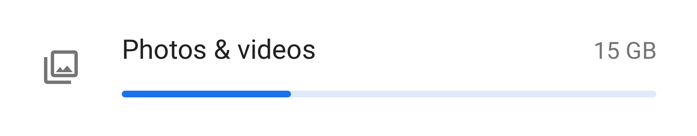

**Figure 22.** Example of menu with icon, title, stat and graph

### Grouping & dividers

If a screen has many settings, they can be grouped and separated by a divider.
Unlike older Android versions, dividers are now used to cluster settings in a
group, rather than separating individual settings.

If the settings in a group are closely related, you can add a group heading. If
you use a group heading, you should always include a divider.

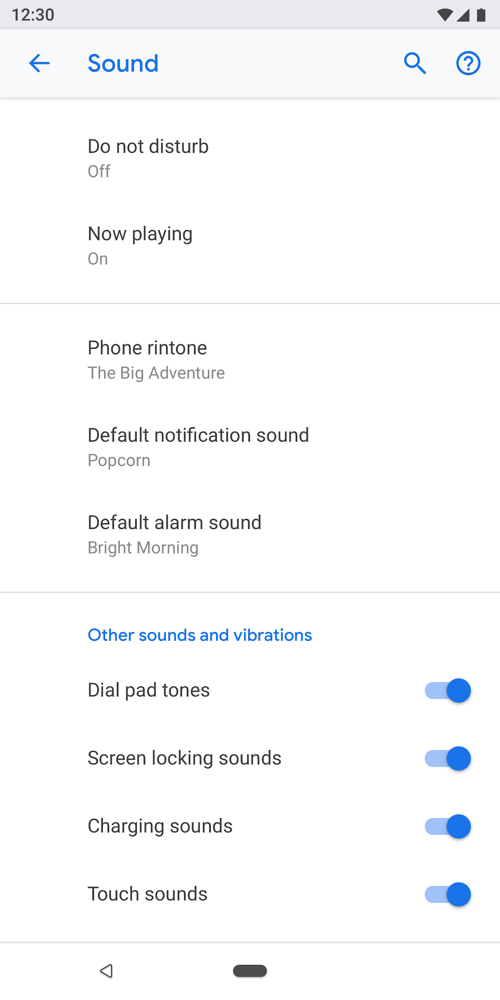

**Figure 23.** Settings grouped with dividers

### Switch

**Switch with icon, title, and subtext**

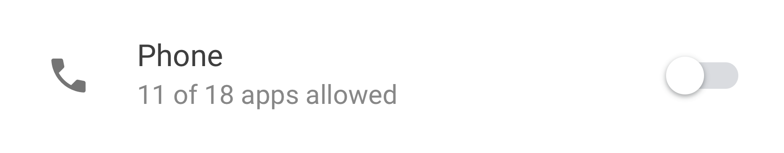

**Figure 24.** Switch with icon, title, and subtext

**Switch with title and subtext**

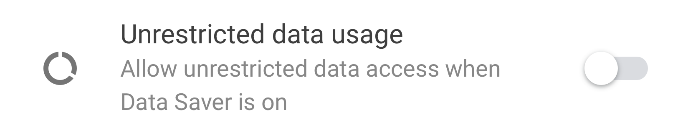

**Figure 25.** Switch with title and subtext

**Switch with title only**

Titles can be accompanied by an icon on the left.

**Figure 26.** Switch with title only

### List item + switch

You can combine a list item with a switch. Tapping on the left side of the
vertical line acts like a link and takes the user to the next screen. The right
side behaves like a standard switch.

For the list item on the left side, a title is mandatory. The icon and subtext
are optional.

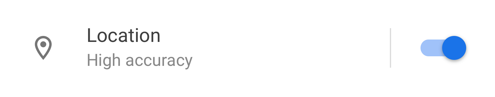

**Figure 27.** List item and a switch

### Slider

The icon is optional in the slider.

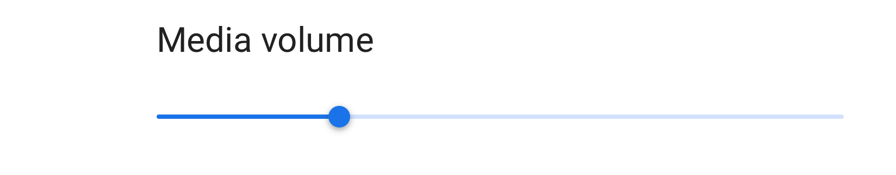

**Figure 28.** Slider

### On-screen button

Positive actions use the theme color while negative actions are gray. Positive
actions may include opening an app, installing an app, adding a new item, etc.
Negative actions include clearing data, uninstalling an app, deleting items,
etc.

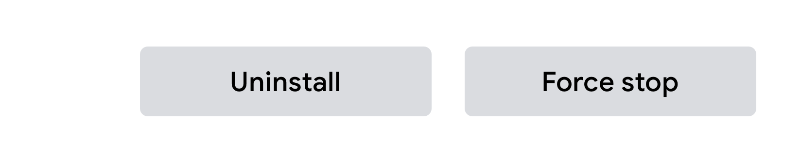

**Figure 29.** Gray buttons for "Uninstall" and "Force stop"

**Figure 30.** Blue button for "Turn on now"

### Progressive disclosure (Advanced)

Settings that are not frequently used should be hidden. Use "Advanced" only when
there are at least 3 items to hide.

Here, the subtext shows the titles of the settings that are hidden. The subtext
should be only one line. Additional text gets truncated with an ellipsis.

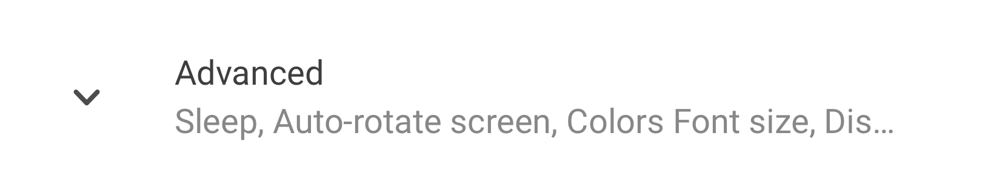

**Figure 31.** Advanced used on the "Display'" screen

### Drop-down menu

Drop-down menus are available, but ideally you should use a dialog or radio
button selection screen instead. This is recommended to simplify settings, as
there are currently three different patterns for single selection.

If needed, drop-down menus can be used in cases where the setting has simple
options.

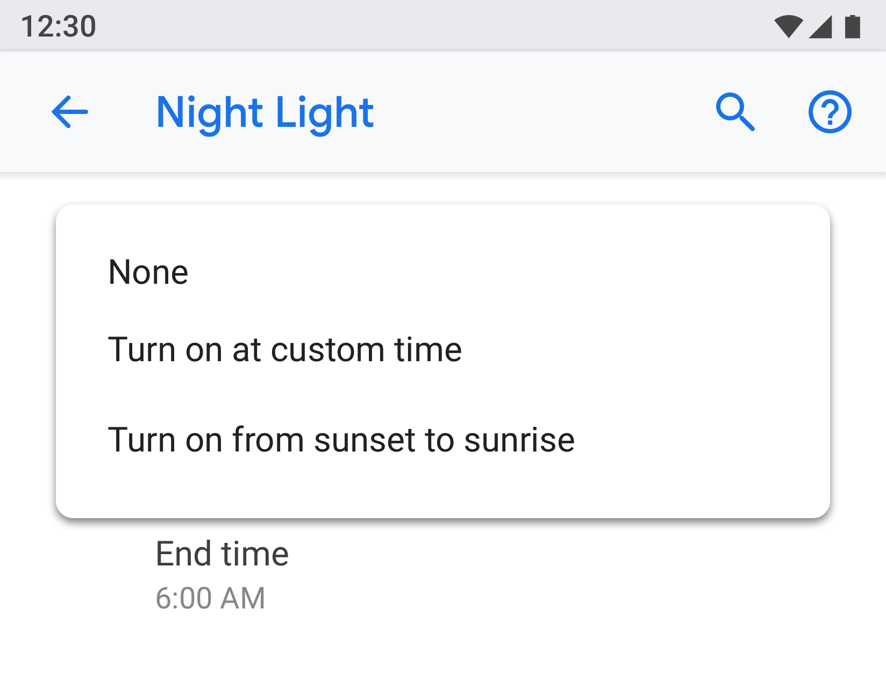

**Figure 32.** Drop-down menu

### Checkbox

Use switches over checkboxes when possible.

Checkboxes can be used:

+   For negative actions like restricting apps or blocking a service.
+   To avoid having too many switches on the screen.

**Figure 33.** Checkboxes are used to reduce the number of switches on this
screen

### Links

Using links in settings is not recommended. Only use links where absolutely
necessary. Links should use an accent color with no underline.

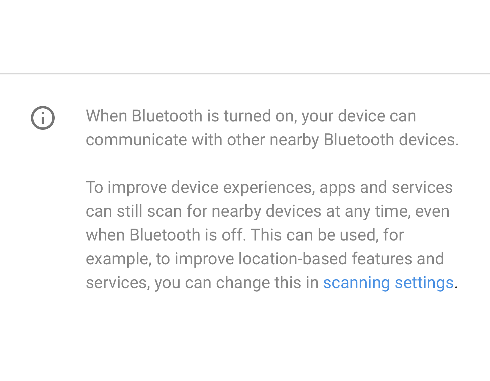

**Figure 34.** Link used in settings

### Footer

Footer text can be used to add explanatory content. The footer should always
have a divider at the top. The footer is shown at the bottom of the screen.
Footers can have links, if needed.

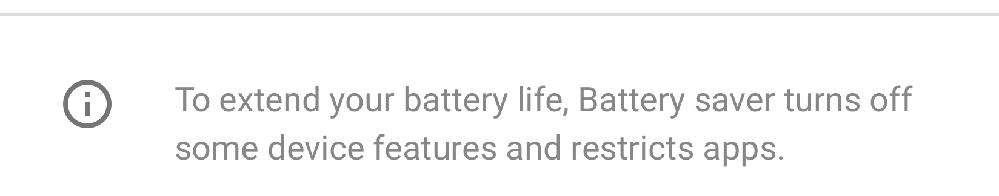

**Figure 35.** Footer text

## Patterns

### Data

Critical data can be shown in a graph like a bar or pie chart. This data can be
shown in the entity header. Examples include mobile data and storage.

Other less critical data can be presented by using a regular list view.

**Figure 36.** Example showing Storage

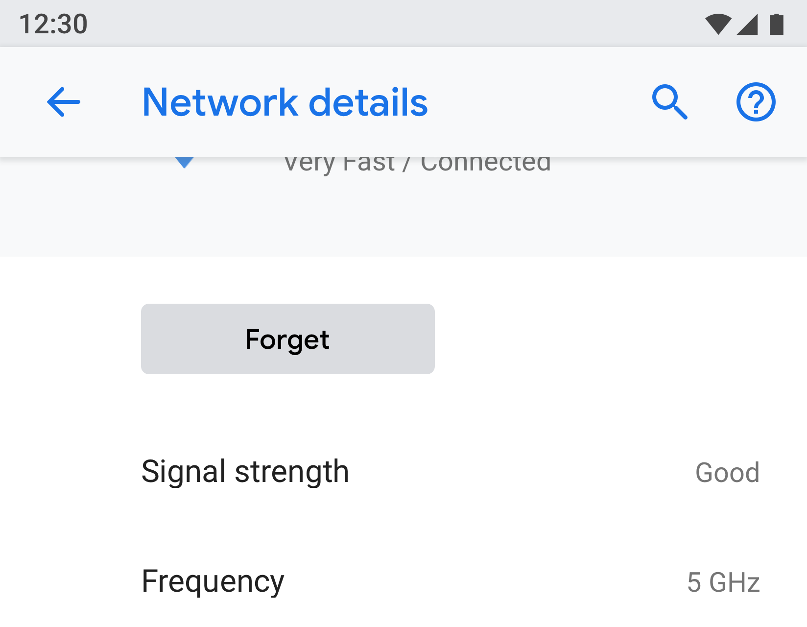

**Figure 37.** Example showing Network

### User education

Some features may need an explanation or user education. You can use an
animation or image along with text. The animation or image should be presented
at the top of the screen, while the footer text can be used to add an
explanation.

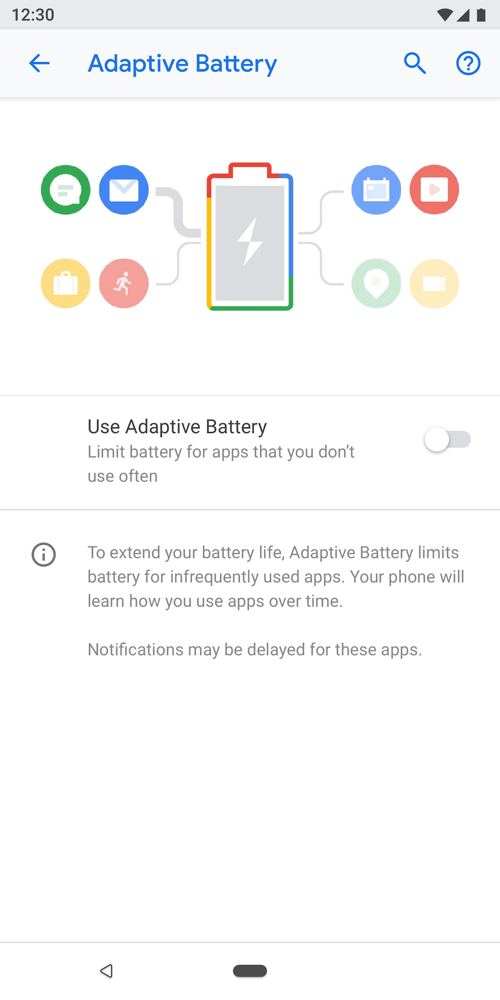

**Figure 38.** Setting using animation and footer text

### Forms

If the form has one input field, use a normal dialog. This provides an easy way
for users to enter a single input.

However, if the form has several fields, consider using a
[full-screen dialog](https://material.io/design/components/dialogs.html#full-screen-dialog){: .external}.
This provides more screen space to arrange the fields in a clear pattern.

**Figure 39.** Form with a normal dialog

### Search results

Search results show the title, subtext (if available), and the breadcrumb
location of the setting.

**Figure 40.** Search result
